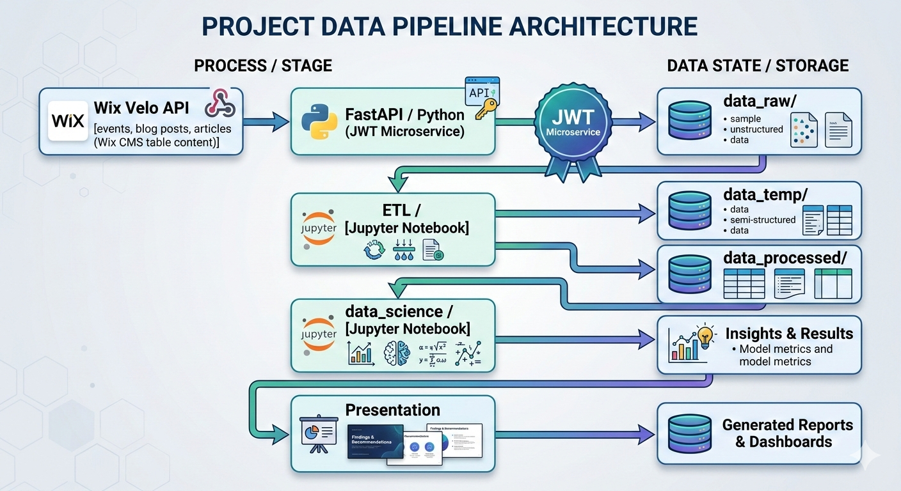

# Wix Content Intelligence Pipeline

This repository explores the basic approach of **Data Engineering** and **Data Science** tools and principles. It covers extracting **real-world data** (events, articles, blog posts) via API, processing it, and performing analysis.

### Inspiration

The basic idea for this project came from the experiences gathered in the <a href="https://dataklub.hu/" target="_blank" rel="noopener noreferrer">DataKlub</a> (_Hungarian_ content).  
For the _English_ speaking community, explore this platform <a href="https://data36.com/" target="_blank" rel="noopener noreferrer">Data36</a>.

### Main Technologies Used

- **Extraction:** Python (FastAPI), Wix Velo API
- **Processing:** Jupyter Notebook, Pandas
- **Visualization:** Matplotlib, Marp (Presentations)
- **Infrastructure:** Linux, Docker, Makefile
- **AI & Automation:** Gemini CLI, pre-commit

ℹ️ This project uses a **local-first** approach with **Docker**, prioritizing **open-source** tools and **data privacy**.

> 💡 **Looking for the big picture?**
>
> - Jump straight to the [Data Pipeline Overview](#data-pipeline-overview) to understand the workflow.
> - View the [Final Presentation](./presentation/presentation.pdf) for a high-level summary of the study's insights.

<br></br>

## Table of Contents

- [Data Pipeline Overview](#data-pipeline-overview)
- [Data Engineering Concepts](#data-engineering-concepts)
- [Cloud Architecture Mapping](#cloud-architecture-mapping)
- [Technical Details](#technical-details)
- [Gemini CLI Integration](#gemini-cli-integration)
- [Jupyter Cleanup & Git Hygiene](#jupyter-cleanup--git-hygiene)
- [Appendix](#appendix)

<br></br>

## Data Pipeline Overview

| Stage          | Process / Service                            | Data State                                     | Description                                                                                                                            |
| -------------- | -------------------------------------------- | ---------------------------------------------- | -------------------------------------------------------------------------------------------------------------------------------------- |
| Source         | **Wix Velo API**                             | Blog posts, Events, Articles (Wix CMS content) | Content managed via _Wix_.                                                                                                             |
| Extraction     | **FastAPI / Python**<br>JWT Microservice     | `data_raw/`                                    | _FastAPI_ microservice fetches `JSON` data. For simplicity, this is a _one-time download_ rather than a continuous ingestion pipeline. |
| Transformation | **ETL Layer**<br>(Jupyter Notebook)          | `data_temp/`<br>`data_processed/`              | Cleaning, normalization, and schema validation.                                                                                        |
| Analysis       | **Data Science Layer**<br>(Jupyter Notebook) | Analysis outputs<br>Models, insights           | Data analysis.                                                                                                                         |
| Presentation   | **Presentation**<br>(Matplotlib)             | Charts, reports, dashboards                    | Conversion of raw numbers into human-consumable insights.                                                                              |

<br></br>

<br></br>

### Data Governance & Directory Mapping

- Data Source — Data was obtained using _Wix Velo_ code during my time as the administrator of the nonprofit organization's <a href="https://www.kiutarakbol.hu/" target="_blank" rel="noopener noreferrer">Wix platform</a>.

- `/data_raw` — Contains the original, unedited dataset. To protect privacy and keep the repo light, this folder is `git-ignored`.

- `/data_raw_dummy` — Tracked by `Git`. Contains representative files with mocked values that match the production schema.

- `/ETL` — Houses the logic for cleaning and validation. This is the "bridge" between raw and processed states

- `/data_temp` — Used for volatile, intermediate states during processing. Not tracked by `Git`.

- `/data_processed` — The final, "science-ready" datasets. Also `git-ignored`.

- `/data_processed_dummy` — Tracked by `Git`. Provides the expected final structure for the analysis.

<br></br>

## Data Engineering Concepts

Mapping the project's structure to standard Data Engineering terminology.

| Concept                  | Implementation in project                    |
| ------------------------ | -------------------------------------------- |
| Data ingestion           | FastAPI microservice extracting Wix CMS data |
| API authentication       | JWT generation for secure requests           |
| Raw data storage         | JSON files stored in `data_raw/`             |
| Data transformation      | Pandas ETL processing                        |
| Data pipeline layering   | raw → temp → processed data folders          |
| Reproducible environment | Docker + docker-compose                      |
| Development workflow     | pre-commit + nbstripout                      |

<br></br>

## Cloud Architecture Mapping

Visualising how the local-first pipeline scales into a cloud-native architecture.

- Google Cloud Example

| Local Component            | Cloud Equivalent                              |
| -------------------------- | --------------------------------------------- |
| FastAPI extraction service | Cloud Run or Cloud Functions                  |
| Local JSON storage         | Cloud Storage                                 |
| Data staging folders       | Cloud Storage buckets (raw / processed zones) |
| Pandas ETL processing      | Cloud Run job or Dataflow                     |
| Analytical datasets        | BigQuery                                      |
| Visual analysis            | Looker Studio                                 |
| Workflow orchestration     | Cloud Composer or Workflows                   |

<br></br>

## Technical Details

### 📦 Prerequisites

- **[Docker Desktop](https://docs.docker.com/get-docker/)**: For containerizing and running the application.
- **Python 3.x**: (Optional, for local development/testing outside Docker)

### 🖥️ Operating System Used

- Linux Mint 21.2 (development environment used)

### 🐳 Data Extraction (FastAPI Microservice)

This container connects to the **data source (Wix)**, generates a **JWT**, and saves raw **JSON** files locally.

1. ✅ **Configuration** (`.env`)

In the root directory of this project, rename the `.env.example` to `.env`.

Populate the file with your environment keys.

> **Security Tip:**  
> Never commit your `.env` file to version control.

2. ✅ **Build the Docker Image**

In your terminal, navigate to your project root (where your `Dockerfile.jwt_microservice` and `.env` are located) and run the following command to build the Docker image:

```bash
docker compose build jwt_microservice
```

3. ✅ **Run the Docker Container**

Still in your project root, run the following command to start the Docker container:

```bash
docker compose up -d jwt_microservice
```

This command will start the container in the background (**_detached mode_**), allowing the terminal to be used for `curl` commands.
The additional setting for `jwt_microservice `could be found in the `docker-compose.yml` file.

4. ✅ **Call the Endpoints**

As the container is running in the detached mode, the same terminal could be used to call the endpoints. This triggers

- the microservice to generate a JWT,
- fetch data from Wix, and
- save it locally.

```Bash
# Execute the `curl` Command to Call an Endpoint
curl http://127.0.0.1:8000/events
```

If successful, the downloaded file (e.g., `wix_events_data.json`) will be saved to your project's `/data_raw `directory (relative to your project root).

Available endpoints:

```Bash
# Download events
curl http://127.0.0.1:8000/events

# Download blog posts
curl http://127.0.0.1:8000/blog/posts

# Download blog categories
curl http://127.0.0.1:8000/blog/categories

# Download blog tags
curl http://127.0.0.1:8000/blog/tags

# Download collection with articles
curl http://127.0.0.1:8000/collections/articles

# Download collection with articles' categories
curl http://127.0.0.1:8000/collections/articles-category

# Download members
curl http://127.0.0.1:8000/members
```

5. ✅ **Shut Down the Docker Container**

This container is supposed to run temporary, just for data fetching, which is one time process in this project. When the data is downloaded, shut down the container with this command:

```Bash
docker compose down
```

### 🔬 Data Cleaning & Analysis

Data preparation and analysis are performed using **Jupyter Notebook** and **Pandas**.

The jupyter container in this project uses the recommended [Docker image](https://hub.docker.com/r/jupyter/datascience-notebook/). The additional packages are included inside `requirements_jupyter.txt` file.

1. ✅ **Build the Docker Image**

In your terminal, navigate to your project root (where your `Dockerfile.jupyter` is located) and run the following command to build the Docker image:

```bash
docker compose build jupyter
```

2. ✅ **Run the Docker Container**

Still in your project root, run the following command to start the Docker container:

```bash
docker compose up -d jupyter
```

3. ✅ **Using Dockerized Jupyter**

First, retrieve the Jupyter URL (containing the security **token**) from the container logs:

```bash
docker compose logs jupyter
```

Look for a URL in the terminal output that looks like this:
`http://127.0.0.1:8888/?token=...`

**Option A: Within the Browser** 🌐
Copy the URL above and paste it directly into your web browser. Or hold `Ctrl` (or `Cmd` on Mac) and click the link directly in the terminal.

**Option B: Within VS Code** 💻

1. Open your `.ipynb` file in **VS Code**.
2. Click **_"Select Kernel"_** in the top right corner.
3. Choose **_"Existing Jupyter Server..."_**.
4. Paste the URL you copied from the terminal and press **_Enter_**.

**VS Code** will now connect to the **Docker container**, and you can **_"just code"_** using the packages installed inside Docker!

> **Note on Persistent Workflow:**  
> This project is configured to use a fixed `JUPYTER_TOKEN` (defined in the `.env`) and a static workspace root (`/home/jovyan/work`). This configuration is visible in the `command` section of the `jupyter` service in `docker-compose.yml`. Unlike default setups that generate a new token on every start, this approach ensures that the VS Code kernel connection remains stable across container restarts, as the connection URL stays the same.

4. ✅ **Shut Down the Docker Container**

When the data is downloaded, shut down the container with this command:

```Bash
docker compose down
```

<br></br>

## Gemini CLI Integration

This project utilises the **Gemini CLI** for automating data analysis tasks, generating documentation, and exploring dataset structures.

Prerequisites:  
Make sure you have the **Gemini CLI** installed and configured on your machine.

[Gemini CLI Documentation](https://geminicli.com/docs/)

### The Tri-File Strategy

Instead of dumping everything into one file, the project documentation was considered in terms of **_Operations_**, **_Truth_**, and **_Persona_**.

#### GEMINI.md (The Operations Manual)

- **_Purpose:_** The **"How-To"** guide for the AI. It explains how to build, test, and maintain the project.
- **_Analogy:_** The Project Manager / Jira
- **_How it works:_** Tells the AI how to interact with the system and maintain the project lifecycle.

#### CONTEXT.md (The Source of Truth)

- **_Purpose:_** The **"Data & Business Domain"** reference. This file should be the "Database Definition and Project Rules" for the AI.
- **_Analogy:_** The Technical Docs / Schema
- **_How it works:_** Defines the data dictionary, schema expectations, and API endpoints to provide a grounded source of truth.

#### AGENT.md (The Persona & Standards)

- **_Purpose:_** The **"Guidelines"** for behavior. This is your "**System Prompt**."
- **_Analogy:_** The Senior Mentor / Pair Programmer
- **_How it works:_** Establishes the AI's persona, coding standards, and operational constraints for consistent, high-quality output.

<br></br>

## Jupyter Cleanup & Git Hygiene

This project uses `nbstripout` to keep notebook outputs out of version control and a `pre-commit` hook to ensure consistent formatting for all files.

- [PyPI: kynan/nbstripout](https://pypi.org/project/nbstripout/)
- [GitHub: kynan/nbstripout](https://github.com/kynan/nbstripout)
- [pre-commit](https://pre-commit.com/)
- [GitHub: pre-commit/pre-commit-hooks](https://github.com/pre-commit/pre-commit-hooks)

Configuration details can be found in `.pre-commit-config.yaml`.

To check all files and automatically clean notebook outputs before committing, run:

```bash
pre-commit run --all-files
```

### Why `pipx`?

Because `nbstripout` and `pre-commit` are **_development lifecycle tools_**—not dependencies required by the code inside your Docker containers—they are managed via `pipx`.

`pipx` installs Python CLI tools into **_isolated virtual environments_**, keeping the system Python clean while making the binaries globally accessible in the terminal.

[Install pipx](https://pipx.pypa.io/stable/installation/)

```bash
# Install the tools globally, but isolated
pipx install pre-commit
pipx install nbstripout
```

**Note on Environment Strategy:** While these tools could be installed in a local `.venv,` `pipx` is more efficient for "meta-tools." This prevents the project environment from becoming cluttered with tools that aren't needed to run the actual code.
<br></br>

## Appendix

- **Commit Standards**: This project follows [Conventional Commits](https://gist.github.com/qoomon/5dfcdf8eec66a051ecd85625518cfd13) to maintain a clear and readable history.
- **Presentation**: Insights are delivered using [Marp](https://marp.app/), allowing for a "Presentation-as-Code" workflow that aligns with the Markdown-centric nature of the project.
- **Automation**: A `Makefile` is provided to simplify usual operations.
